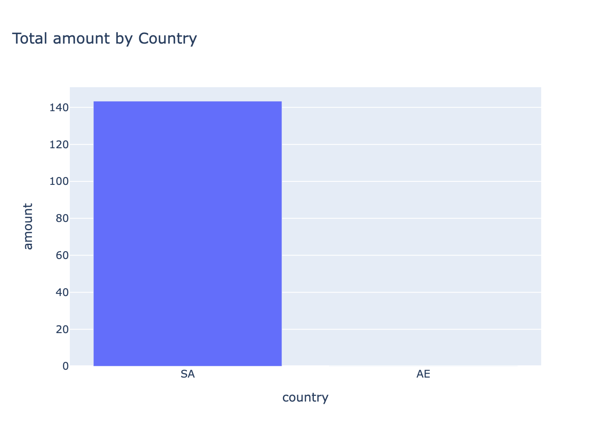
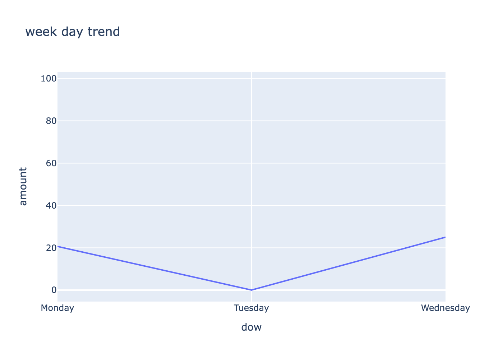

# Summary of Findings and Caveats

This summary is based on this notebook `notebooks/eda.ipynb`.

## Key Findings

- SA accounts for 100% of total amount ($143.39), AE has nothing
- Monday: $20.64, Tuesday: $0.00, Wednesday: $25.00, Missing dates: $97.75
- Average order value: $35.85 (mean), $18.75 (median)
- One outlier at $97.75 affects mean and std
- Refund rate: 20% (1 out of 5 orders)

## Definitions

- **Amount**: Sum of amount column
- **Mean (Average)**: Sum of all values divided by the number of values. For order amounts, mean = $35.85
- **Outlier**: A value that is very different from other values. The $97.75 order is an outlier because it's much higher than the average
- **Median**: The middle value when all values are sorted. For order amounts, median = $18.75
- **Refund rate**: 20% of orders are refunds

## Data Quality Caveats

### Missingness
- 20% missing in amount and quantity (1 out of 5 orders)
- 20% missing created_at (1 out of 5 orders)

### Other Issues
- Very small sample size (only 5 orders total)
- Not enough data for AE country
- Missing dates with significant amounts ($97.75)
- Tuesday shows $0.00 but cannot be interpreted due to missing dates

## Next Questions

- Refund rate vary by month?
- Why do some orders have missing amount/quantity?
- Why we have missing created_at timestamps?
